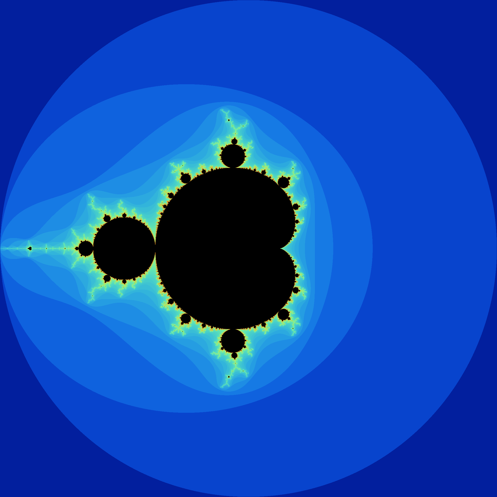
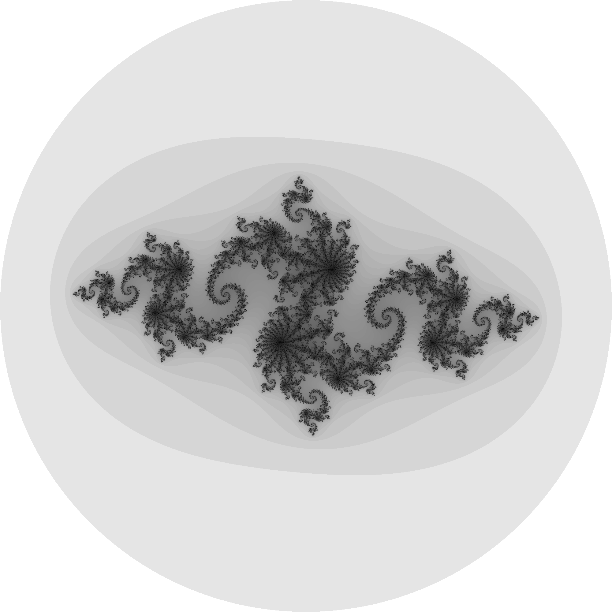
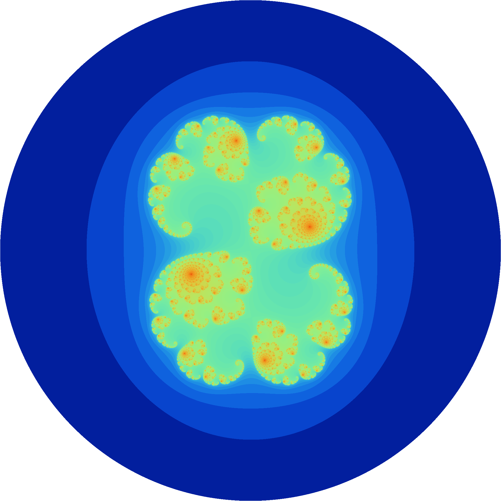

# Aion

Aion is a Haskell application designed to calculate and render simple Mandelbrot- and Julia set fractals.

## Functionality:

### Supported Fractal Types
- Mandelbrot Sets
- Julia Sets

### Available Rendering Methods
1. Print to console using ASCII characters
2. Save ASCII output to a `.txt` file
3. Save as a grayscale image
4. Save as a colored image

## How to use
1. Load the .exe in a Terminal or Powershell window
2. Follow the steps provided by the application

## How to compile

1. Clone the project to any directory using: `git clone https://github.com/Kyotem/Aion.git`
2. Open a terminal in the main project directory
3. Update dependencies: `cabal update`
4. Build the executable: `cabal build`

After building, the executable can be found at: `./dist-newstyle/build/x86_64-windows/ghc-9.6.7/Aion-0.1.0.0/x/Aion/build/Aion/Aion.exe`

Load this `.exe`via a terminal or powershell window to use the program.

## Dependencies:
(Based upon the Aion.cabal file)
- JuicyPixels 3.3.9
- filepath
- parallel

## Authors

- [@Kyotem](https://github.com/Kyotem/)

